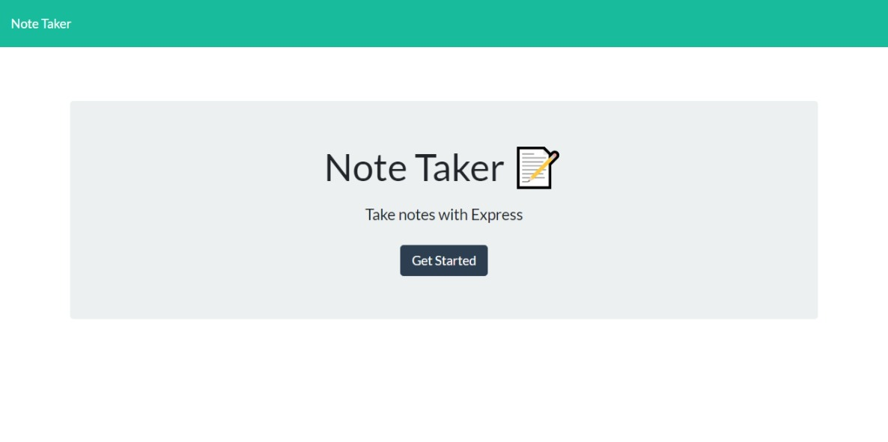

# Note_Taker
[](https://opensource.org/licenses/MIT)

## Table of Contents
 
* [Description](#Description "Goto Description")
* [Installation](#Installation "Goto Installation")
* [Usage](#Usage "Goto Usage")
* [Contributions](#Contributions "Goto Contributions")
* [Tests](#Tests "Goto Tests")
* [Questions](#Questions "Goto Questions")
- - - -


## Description

This project takes user notes, stores them, and appends them onto the page. It can also delete the posts as well. This application allows people to store their notes on a page in case they want save something and not forget about it. This project uses nodejs, express, css, html, and vanilla js. fs was also used for the file paths.

## Installation

In order to install this application you are going to need to install express 

```
nmp i
```


## Usage

After forking, cloning, and running npm i in the terminal, type the command npm start. Then click the link and go to the note taker. Once you've entered into the main portion of the note taker, write some notes, click the save icon to save them and press the trash icon to delete them.


<br>
[Application in action](undefined)
<br>
[Deployed application](https://stormy-basin-51525.herokuapp.com/)

## Contribution Guidelines

Faizila, Jessica, Jason, and my TA, Veronica, helped me with this project. My classmates's githubs will be listed below:

* [Faizila's GitHub](https://github.com/Faizila)

* [Jessica's GitHub](https://github.com/jessicamcg)

* [Jason's GitHub](https://github.com/jasonluxie)


## Tests

No tests


## Licence

This application uses [License: MIT](https://opensource.org/licenses/MIT)


## Questions

To see more of my projects visit my page below:
[My GitHub](https://github.com/BossyLemon0)

If you have any questions you can contact me through my email:
omardramirez2002@gmail.com

[Back to Top](#Note_Taker "Goto top")
